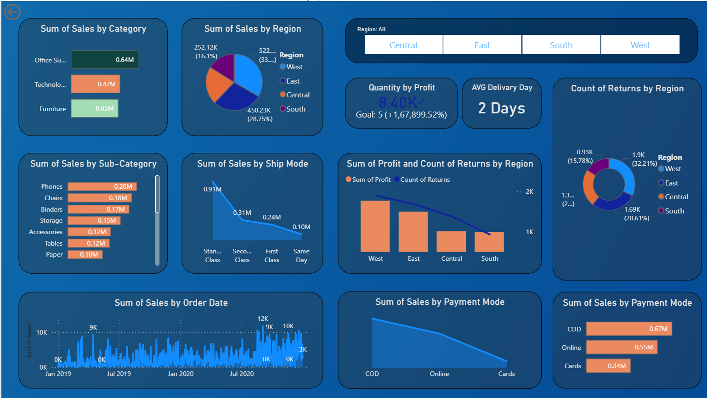

# 📊 SuperStore Sales Dashboard

> Power BI dashboard analyzing $1.57M in SuperStore sales — categories, regions, trends & profit insights (2019–2020)

---

## 🖼️ Dashboard Preview



> *Replace `dashboard-preview.png` with your actual screenshot after exporting from Power BI*

---

## 📌 Overview

An interactive **Power BI dashboard** built on the SuperStore retail dataset, covering **5,901 transactions** across **773 customers** and **3,003 orders** from January 2019 to December 2020. The dashboard uncovers key business insights around sales performance, profit margins, regional trends, and customer segmentation.

---

## 🔍 Key Insights

- 💰 **Total Sales:** $1.57M | **Total Profit:** $175K | **Profit Margin:** 11.2%
- 📈 **Sales grew 77% YoY** (2019 → 2020), but profit margin dropped from **14.5% → 9.3%**
- 🏆 **Technology** is the most profitable category at **19.2% margin**
- 🪑 **Tables, Supplies & Bookcases** are loss-making sub-categories
- 🗺️ **Texas** ranks 3rd in sales ($116K) yet loses **$14K in profit**
- 🌍 **West region** leads with 33% of total sales
- 💳 **COD** is the dominant payment mode at 40% of all orders

---

## 📂 Dashboard Pages

| Page | Description |
|------|-------------|
| 📋 Executive Summary | High-level KPIs — Sales, Profit, Orders, Customers |
| 🗂️ Category & Sub-Category P&L | Profitability breakdown by product category |
| 🗺️ Regional Sales Map | State-wise sales and profit performance |
| 📅 Monthly Trend Analysis | Sales & profit trend across 2019–2020 |
| 🚚 Shipping & Payment Breakdown | Ship mode and payment mode distribution |

---

## 📁 Dataset

| Attribute | Details |
|-----------|---------|
| Source | SuperStore Sales Dataset |
| Rows | 5,901 |
| Columns | 23 |
| Period | Jan 2019 – Dec 2020 |
| File | `SuperStore_Sales_DataSet.xlsx` |

---

## 🛠️ Tools Used

- **Power BI Desktop** — Dashboard development
- **Microsoft Excel** — Data source (.xlsx)
- **DAX** — Calculated measures and KPIs
- **Power Query** — Data transformation and cleaning

---

## 🚀 How to Open

1. Download and install [Power BI Desktop](https://powerbi.microsoft.com/desktop) *(free)*
2. Clone or download this repository
3. Open `project.pbix` in Power BI Desktop
4. No credentials required — data is fully embedded

```bash
git clone https://github.com/pratikpawar/superstore-sales-dashboard.git
```

---

## 📸 Screenshots

> Add screenshots of each dashboard page inside a `/screenshots` folder and link them below:

```
screenshots/
├── executive-summary.png
├── category-analysis.png
├── regional-map.png
├── monthly-trend.png
└── shipping-payment.png
```

---

## 👤 Author

**Pratik Pawar**

[](https://github.com/pratikpawar)
[](https://linkedin.com/in/pratikpawar)

---

## 📄 License

This project is open source and available under the [MIT License](LICENSE).

---

> ⭐ If you found this project helpful, consider giving it a star on GitHub!
